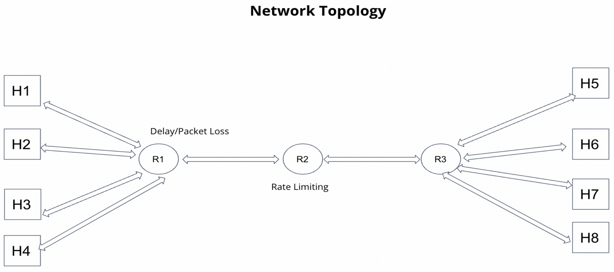
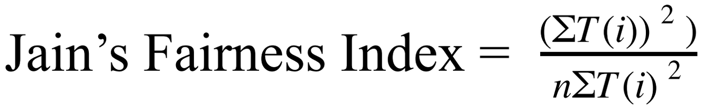

# Performance Evaulation of BBRv2 Congestion Control Algorithm

In this project, we sought to analyze the performance of BBRv2 and compare it to its predecessor, BBRv1. BBR stands for Bottleneck Bandwidth and RoundTrip Time, and is a TCP congestion control algorithm. BBRv1 had some performance issues, namely RTT unfairness and incompatibility with other congestion control algorithms, and so we tried to see how BBRv2 addresses these problems.

The topology we used for the experiments was as follows.

There are four hosts on either side of three routers. Router R1 injects packet delay and loss and R2 acts as the the bottleneck by using Token Bucket Filtering for rate limiting.

To test RTT unfairness for BBRv1 and BBRv2, we gave the four sending hosts on the left side different delays on their link to R1. Then we ran the experiment once while they all used BBRv1 and another time with them all running BBRv2. Iperf3 was used to measure the throughput of each host and then we used the Jain index to get a measure of the overall fairness.

Here, T(i) is the throughput for the ith flow and n is the total number of flows.

To test compatibility with other protocols, we did experiments with two sending hosts running cubic and the other two hosts both running either BBRv1 or BBRv2. Similarly, we used iperf3 to measure the throughput at each host and used the Jain index to calculate fairness.

## How to Run

This repo contains the code used to peform this project. The python script ProjectTopo.py is used to set up the mininet topology and run various experiments.
There are commented lines that tell you which parameters to change in order to test certain configurations. For example you can modify the
loss rates at r1, the bandwidth and buffer size at r2's link to r3, the rtt for different hosts, and the TCP algorithms they run.

The test_results directory contains some experimental results we obtained while testing the different configurations, and also a simple script to help parse the data for easier visualization.

To run the experiment, make sure you have the TCP algorithms already installed in your kernel. Then, you can do

`sudo python3 ProjectTopo.py.`

If you wish to terminate it early for any reason, then you can do a simple ctrl-c, but make sure you then kill the bird routing protocol processes
as well. Failure to do so will cause an error next time you try to run the program.

`sudo pkill -f bird.`
